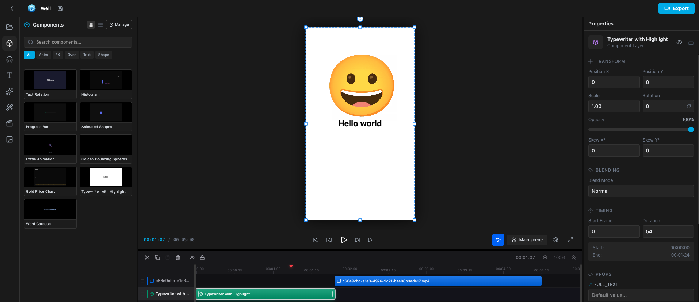

<table width="100%">
  <tr>
    <td align="left" width="120">
      
    </td>
    <td align="right">
      <h1>Remotoon</h1>
      <h3 style="margin-top: -10px;">A free and open source programatically video editor based on webapp</h3>
    </td>
  </tr>
</table>

[](LICENSE)

# 🎬 Remotion Editor (Remotoon)

A premium, powerful **Just-in-Time (JIT) Component Studio** for creating dynamic videos with [Remotion](https://www.remotion.dev/). Build and arrange video compositions using custom React components with live compilation, timeline controls, assets/effects libraries, and real-time previews.



## ✨ Core Features & Enhancements

- ✦ **AI Studio (prompt → motion graphics)** - Describe an animation and an LLM writes a Remotion component that is compiled in your browser and dropped straight onto the timeline. You watch the code stream onto the canvas while it's written.
  - **Edit selected layer** in plain language ("make it snappier", "sunset palette"); the component is hot-swapped with one-click Revert / Re-apply.
  - **Self-healing code**: compile errors and runtime crashes are sent back to the model automatically (configurable retries). Each layer has its own error boundary, so one broken component never takes down the preview.
  - **Auto-generated controls**: every `$PROPS.NAME ?? default` becomes a color picker, slider, toggle or text field in the Properties panel.
  - **Bring your own model**: OpenAI, Anthropic, Google Gemini, OpenRouter, Groq, local Ollama, or any OpenAI-compatible endpoint. Press **⌘K / Ctrl+K** anywhere in the editor to prompt.
- 🎛️ **Live Code tab** - Edit the selected component's code in Monaco; valid code is compiled and applied as you type.
- 🔤 **Text, Effects, Transitions & Filters** - Animated text presets, stackable motion effects (Ken Burns, shake, glitch, float…), enter/exit transitions and color filters that apply to any layer and render identically in export.
- 🚀 **JIT Compilation** - Write and compile custom React / TSX components dynamically in the browser using Babel Standalone.
- 🎨 **Dynamic Sidebar Tabs & Panel System** - A modular sidebar containing:
  - **Assets**: Upload and manage media assets.
  - **Audio & SFX**: Integrated audio track selector with a built-in **Sound Effects (SFX)** library powered by `@remotion/sfx`.
  - **Text**: Custom text styling overlays.
  - **Stickers & Emojis**: Interactive sticker selection alongside a searchable **Animated Emojis** tab powered by `@remotion/animated-emoji`.
  - **Effects, Transitions & Filters**: Advanced options for fine-tuning visual aesthetics and scene transitions.
- ✏️ **Header Component Editing** - Inline editable Component Names in detail and edit headers, matching the project name workflow.
- 🌐 **Dynamic SEO & Metadata** - Dynamic document titles and meta tags updated automatically per view/page to optimize SEO and browser history.
- 📐 **Multiple Formats** - Portrait (9:16) for TikTok/Reels, Landscape (16:9) for standard YouTube, and Square (1:1) for Instagram feeds.
- 🕐 **Timeline Control** - Frame-accurate playback, scrubbing, and seeking with a customized preview player.

---

## 🚀 Getting Started

### Prerequisites

- Node.js 18+
- npm or yarn

### Installation

```bash
# Clone or open the project folder
cd remotoon

# Install dependencies
npm install

# Start the development server
npm run dev
```

Open your browser and navigate to `http://localhost:5173` (or the port specified by Vite).

---

## 📝 Usage

### 1. Create or Manage Projects
Click the **Create New Project** button or `+` icon in the project manager. Select a format:
- **Portrait (9:16)** - 1080×1920 (Reels, TikTok)
- **Landscape (16:9)** - 1920×1080 (YouTube)
- **Square (1:1)** - 1080×1080 (Instagram Feed)

### 2. Live Code & JIT Components
Choose any component layer from the **Components Panel**, then shift to the **Code Editor** view. You can write standard TSX with live updates:
```tsx
const { useCurrentFrame, useVideoConfig, AbsoluteFill, interpolate } = React;

function MyComponent() {
  const frame = useCurrentFrame();
  const { fps, durationInFrames } = useVideoConfig();
  const opacity = interpolate(frame, [0, 30], [0, 1], { extrapolateRight: 'clamp' });
  
  return (
    <AbsoluteFill style={{ display: 'flex', justifyContent: 'center', alignItems: 'center', backgroundColor: '#0f172a' }}>
      <h1 style={{ color: '#38bdf8', opacity, fontSize: '4rem' }}>Dynamic Title</h1>
    </AbsoluteFill>
  );
}
```

### 3. Generate with AI
1. Open a project; the **AI Studio** tab (✦, top of the left rail) is selected by default.
2. Click **Connect AI**, pick a provider, paste your API key and choose a model (use **Fetch available models** if unsure). **Test connection** verifies it.
3. Describe what you want, or pick a suggestion. Select a component layer to switch to **Edit selected**.

> **Security note:** API keys are stored in your browser's `localStorage` and requests go directly from the browser to the provider. Use keys with spending limits and avoid shared machines. For local models, start Ollama with `OLLAMA_ORIGINS=* ollama serve` so the browser can reach it.

### 4. Sound Effects (SFX) & Animated Emojis
- Go to the **Audio** tab in the Left Sidebar and select the **SFX** tab to browse sound effects from `@remotion/sfx` and preview them directly.
- Go to the **Stickers** tab and select the **Emojis** tab to search and add high-quality animated emojis powered by `@remotion/animated-emoji`.

---

## 🏗️ Project Structure

```
remotoon/
├── src/
│   ├── components/
│   │   ├── editor/          # Editor & Sidebar UI Components
│   │   │   ├── AssetsPanel.tsx
│   │   │   ├── AudioPanel.tsx        # Features SFX search/preview
│   │   │   ├── CodeEditor.tsx
│   │   │   ├── ComponentsPanel.tsx
│   │   │   ├── StickersPanel.tsx      # Features Animated Emojis tab
│   │   │   ├── LeftSidebar.tsx        # Dynamic tab/panel navigation
│   │   │   ├── RightSidebar.tsx
│   │   │   ├── SceneManager.tsx
│   │   │   └── TemplateSelector.tsx
│   │   └── preview/         # Playback & Video Previews
│   │       └── PreviewPlayer.tsx
│   ├── store/
│   │   └── editorStore.ts   # Zustand state management
│   ├── App.tsx              # Main Router and Dynamic SEO Meta setup
│   ├── RemotionRoot.tsx     # Remotion composition context
│   └── main.tsx             # Application Entry
├── package.json
└── vite.config.ts
```

---

## 🛠️ Technologies Used

- **Framework**: [React](https://react.dev/) + [Vite](https://vitejs.dev/)
- **Video Engine**: [Remotion](https://www.remotion.dev/)
- **Code Editing**: [@monaco-editor/react](https://github.com/suren-atoyan/monaco-react)
- **Styling**: [Tailwind CSS](https://tailwindcss.com/)
- **State Management**: [Zustand](https://github.com/pmndrs/zustand)
- **Rich Assets**:
  - `@remotion/animated-emoji` for beautiful vector animated emojis
  - `@remotion/sfx` for integrated, license-free audio effects
- **Dynamic Compilation**: `@babel/standalone`

---

## 🧪 Development & Production Commands

```bash
# Start local dev server
npm run dev

# Run TypeScript compilation and build production assets
npm run build

# Preview the local production build
npm run preview
```

## 📄 License

MIT - see [LICENSE](LICENSE).

## 🙏 Credits

Built with ❤️ using [Remotion](https://www.remotion.dev/) by [Jonny Burger](https://twitter.com/JNYBGR) and contributors.
